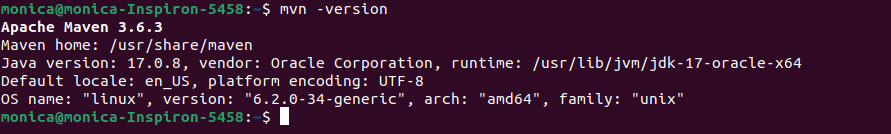

## Instalação

### No terminal:

1-  Atualize os pacotes

```jsx
sudo apt update
```

2 - Instale o maven com o seguinte comando

```jsx
sudo apt install maven
```

O maven deverá ser instalado em um dos seguintes caminhos **/usr/share/maven**
 ou **/etc/maven**.
 <br>


3 - Configurar variáveis de ambiente Maven 
Na próxima etapa, configuraremos as variáveis de ambiente criando um arquivo de script maven “[maven.sh](http://maven.sh/)” dentro do diretório “/etc.profile.d”:

```jsx
sudo nano /etc/profile.d/maven.sh
```

4 - No arquivo “[maven.sh](http://maven.sh/)” aberto, cole o código a seguir e pressione “CTRL+O” para salvá-lo:

```jsx
export JAVA_HOME=/usr/lib/jvm/jdk-17-oracle-x64
export M2_HOME=/opt/maven
export MAVEN_HOME=/opt/maven
export PATH=${M2_HOME}/bin:${PATH}
```

5 - Em seguida, escreva o seguinte comando para habilitar a permissão executável do script Apache Maven criado:

```jsx
sudo chmod +x /etc/profile.d/maven.sh
```

6 - Após fazer isso, carregue as variáveis de ambiente com a ajuda do seguinte comando “source”:

```jsx
source /etc/profile.d/maven.sh
```

Verificando a versão:
```jsx
mvn -version
```



<br>

## Explicação Variaveis de ambiente:

1. **`JAVA_HOME`**:
    - A variável **`JAVA_HOME`** é usada para apontar para o diretório raiz da instalação do Java em seu sistema. Ela informa a outras ferramentas, como o Maven, onde encontrar a instalação do Java que você deseja usar. Neste caso, você a configurou para apontar para a instalação do Java 17 da Oracle em **`/usr/lib/jvm/jdk-17-oracle-x64`**. Isso permite que o Maven e outras ferramentas saibam qual versão do Java usar para compilar e executar seus projetos Java.
2. **`M2_HOME`**:
    - A variável **`M2_HOME`** aponta para o diretório de instalação do Apache Maven em seu sistema. É uma convenção usada por algumas ferramentas para localizar a instalação do Maven. Você configurou esta variável para apontar para o diretório de instalação do Maven em **`/opt/maven`**.
3. **`MAVEN_HOME`**:
    - Similar à variável **`M2_HOME`**, a variável **`MAVEN_HOME`** também aponta para o diretório de instalação do Apache Maven em seu sistema. É outra convenção usada por algumas ferramentas para localizar a instalação do Maven. Você configurou esta variável para apontar para o mesmo diretório de instalação do Maven em **`/opt/maven`**.
4. **`PATH`**:
    - A variável **`PATH`** é uma lista de diretórios onde o sistema procura por programas executáveis quando você digita um comando no terminal. Quando você adiciona **`${M2_HOME}/bin`** ao **`PATH`**, está incluindo o diretório de binários do Maven na lista de diretórios onde o sistema procura por programas executáveis. Isso permite que você execute comandos do Maven diretamente no terminal, como **`mvn`**, em vez de digitar o caminho completo para o executável.

Em resumo, essas variáveis de ambiente são usadas para configurar e facilitar o uso do Maven em seu sistema, apontando para sua instalação do Maven e para a versão específica do Java que você deseja usar com o Maven.