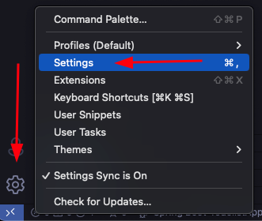
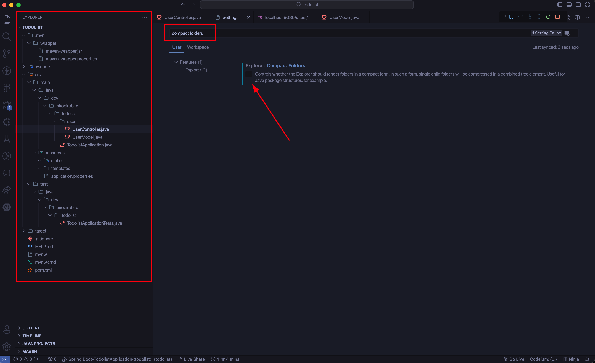

## Instalação

A instalação do VSCode pode ser feita através do link:  https://code.visualstudio.com/Download

## Configuração Java no VS Code

Para utilizar o Java no VSCode, é necessário instalar as extensões abaixo:

- **vscjava.vscode-java-pack**
    - vscjava.vscode-java-debug
    - vscjava.vscode-java-test
    - vscjava.vscode-java-dependency
    - vscjava.vscode-maven
    - redhat.java
- **vscjava.vscode-spring-initializr**
- **vmware.vscode-spring-boot**
- **vscjava.vscode-spring-boot-dashboard**

## Recomendação

Recomendamos que você deixe a opção `compact folders` do VS Code `desmarcada`. 

1. Clique na engrenagem e depois em Settings 

2. Na barra de pesquisa, pesquise por compact folders e Desmarque essa opção, dessa forma o explorador de arquivos ficará no modelo de árvore e você terá uma melhor visualização das pastas do projeto. 
